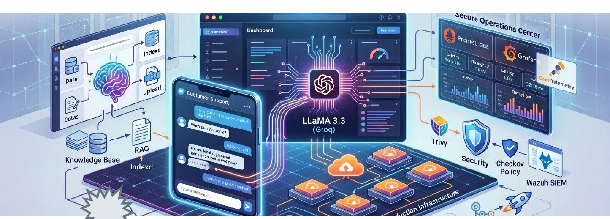
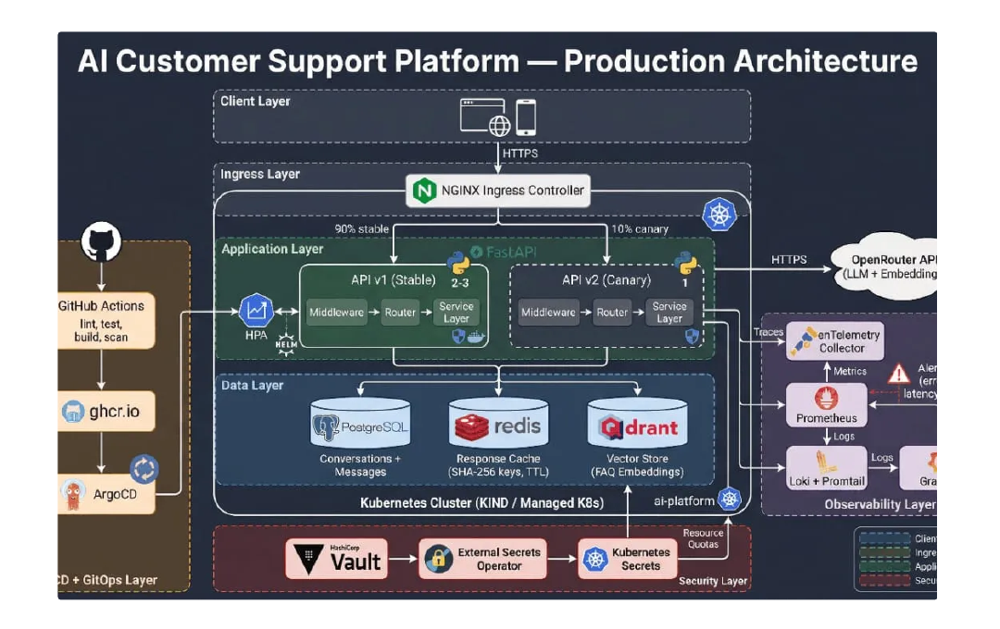
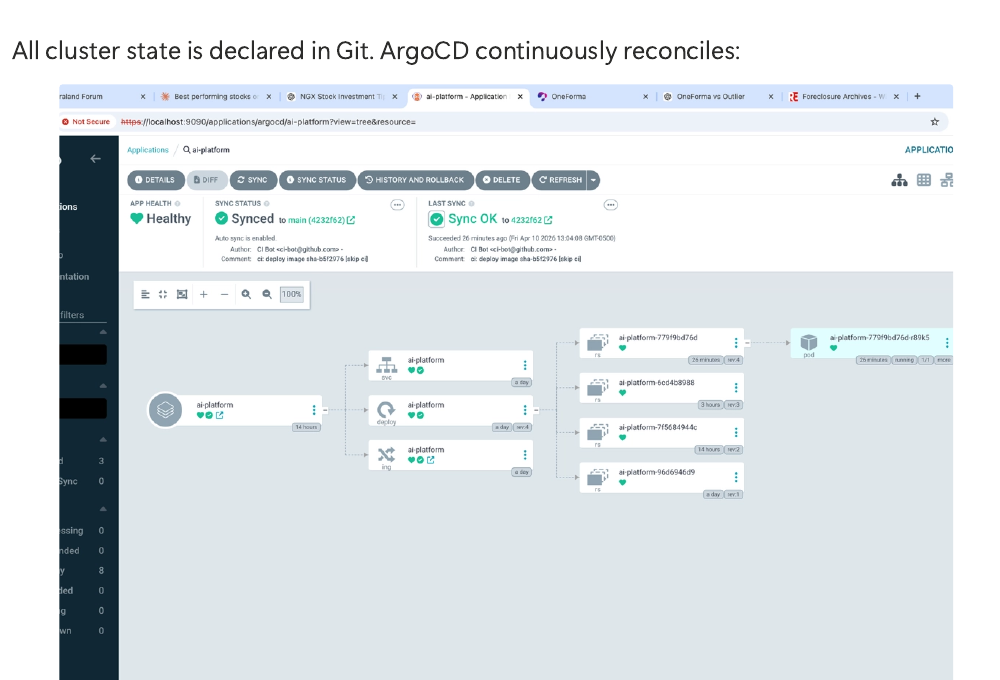
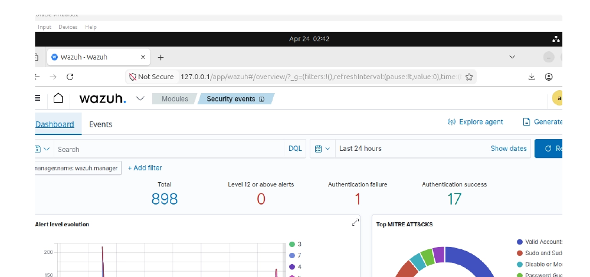
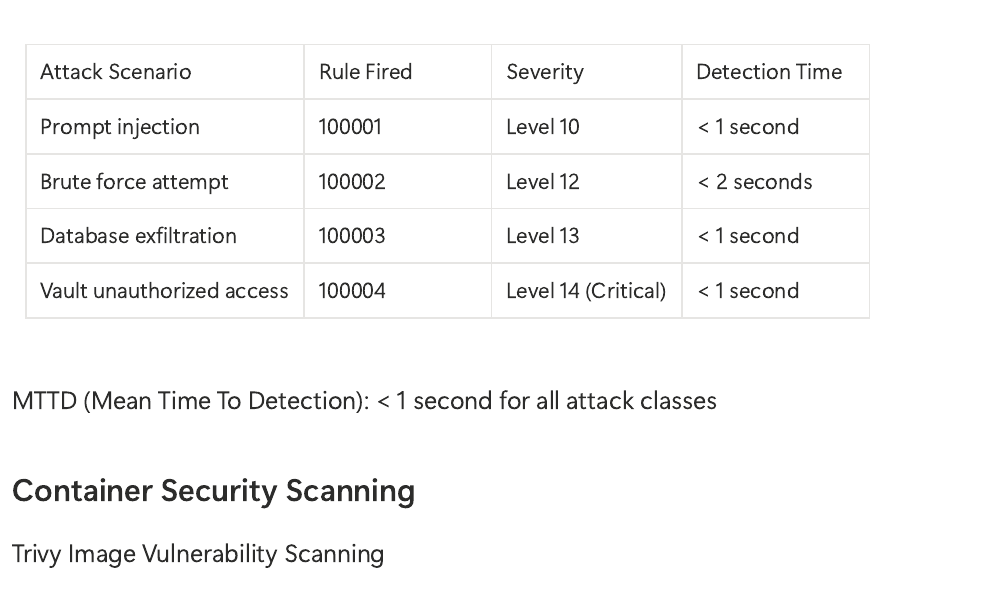

# AI-Customer-Support-Platform-Overview
# 🤖 AI Customer Support Platform — Production Engineering Deep Dive

**Group Project · Expadox Lab Cohort 1, 2026**
**My Role:** Security Team Lead — led SOC design, threat detection, and security validation for this platform.

---

## 📌 Executive Summary

The AI Customer Support Platform is an intelligent, scalable chatbot system powered by Groq's LLaMA 3.3 70B large language model, deployed on AWS EKS with enterprise-grade DevOps, cloud infrastructure, and security operations. The platform processes customer queries in real time, uses Retrieval Augmented Generation (RAG) to search company knowledge bases, caches responses in Redis, and supports document uploads (PDF, Word, Excel) as additional context.

This was a three-team collaborative build — **Cloud**, **DevOps**, and **Security** — combining Infrastructure as Code (Terraform), GitOps (ArgoCD), CI/CD (GitHub Actions), full observability (OpenTelemetry, Prometheus, Grafana), and security operations (Wazuh SIEM, Trivy, Checkov, Cosign).

📦 **Source Code Repository:** [AI-Customer-Support-Platform](https://github.com/glare247/AI-Customer-Support-Platform) *(built and maintained by the DevOps/Cloud teams)*

---

## 🧰 Technology Stack (20+ Tools Across 3 Layers)

**AI & Application Layer:** Groq LLaMA 3.3 70B · FastAPI · Qdrant (vector DB) · Redis (cache) · PostgreSQL 16 · OpenTelemetry

**Infrastructure & Orchestration:** AWS EKS (Kubernetes 1.35) · Amazon ECR · AWS ALB · AWS VPC · Terraform · S3 remote state

**CI/CD & GitOps:** GitHub Actions (5-stage pipeline) · ArgoCD · Helm · Docker

**Observability:** Prometheus · Grafana · Loki · Filebeat · Tempo + OpenTelemetry

**Security Operations:** Wazuh SIEM v4.7.0 · Trivy · Checkov · Cosign v3.0.6 · AWS IAM/RBAC · CloudTrail · Prowler

---

## 🏗️ Three Engineering Pillars

### Pillar 1 — Cloud Infrastructure *(Cloud Team)*
Designed and provisioned a secure, highly available AWS architecture with 100% Infrastructure as Code:
- **EKS Cluster** (`sentinel-eks-cluster`) — Kubernetes 1.35, t3.small node groups, autoscaling 1–5 nodes, IRSA for IAM-to-pod mapping
- **AWS VPC** — Multi-AZ public/private subnets, NAT Gateway, ALB with HTTPS/TLS
- **IAM & Access Control** — Least-privilege groups for DevOps and Security teams, GitHub Actions OIDC role (no static credentials)
- **Terraform** — All infrastructure version-controlled, with S3 remote state (encrypted) enabling full environment rebuild in minutes

**Cloud Team:** Kosi Eneh (IAM & DevOps config) · Grace (Terraform IaC) · Great (IAM security policies) · Yusuf (Monitoring & security integrations)

---

### Pillar 2 — DevOps & GitOps *(DevOps Team)*
Built the full software delivery pipeline and Kubernetes orchestration:
- **CI/CD (GitHub Actions)** — 5-stage automated pipeline: Lint & Test → Build & Push to ECR → Update Helm Values → ArgoCD GitOps Sync → Health Validation
- **GitOps (ArgoCD)** — Git as single source of truth; auto-sync + self-heal; no manual `kubectl apply`

- **Resilience** — Horizontal Pod Autoscaling (CPU/memory-based), Kubernetes NetworkPolicies for pod-level segmentation, canary deployments with traffic splitting (25% → 50% → rollback on metric degradation)
- **Observability** — OpenTelemetry distributed tracing, Prometheus metrics, Grafana dashboards (latency, cache hit ratio, pod health), Loki + Filebeat log aggregation
- **Disaster Recovery** — Nightly automated PostgreSQL backups to S3 with automated restore procedures

**DevOps Team:** Owofola Olakunle (Team Lead — orchestration architecture) · Kabir Bello (CI/CD pipeline) · Umaru Abdulrahman (Kubernetes manifests, Helm) · Abdulhayyu Shuaib (Observability stack)

---

### Pillar 3 — Security Operations Centre (SOC) *(Security Team — my team, which I led)*

The Security Team deployed a unified Wazuh SIEM with 100% agent coverage, custom detection rules, container image scanning, and infrastructure compliance validation — layered directly onto the Cloud/DevOps infrastructure above.

**Wazuh SIEM Deployment** — 3-component architecture (Manager, Indexer/OpenSearch, Dashboard), single-node Docker Compose deployment, 100% log coverage across OS-level activity, Kubernetes pods (via Filebeat DaemonSet), PostgreSQL queries, and application events.

**4 Custom Detection Rules — all validated via live attack simulation:**

| Rule | Threat | Severity | Detection Time |
|---|---|---|---|
| 100001 — Prompt Injection | Jailbreak / adversarial AI input | High (Lvl 10) | < 1 second |
| 100002 — Brute Force | Credential stuffing / password guessing | High (Lvl 12) | < 2 seconds |
| 100003 — Data Exfiltration | Bulk unauthorized DB queries | Very High (Lvl 13) | < 1 second |
| 100004 — Vault Unauthorized Access | Secrets theft / credential compromise | Critical (Lvl 14) | < 1 second |

**MTTD (Mean Time to Detection): under 1 second across all attack classes.**

**Container & Supply Chain Security:**
- **Trivy** — scanned all container images; 25 CVEs identified (1 Critical, 8 High, 15 Medium, 1 Low)
- **Checkov** — validated Terraform/Helm against 200+ policies; 6 misconfigurations found (all remediated or compensated via network policies/IAM)
- **Cosign** — cryptographic image signing for supply chain integrity before ArgoCD deployment

**Feedback loop:** As Security Team Lead, findings from this pillar (the 25 CVEs, 6 misconfigurations, and 4 detection rules) were formally reported back to the Cloud and DevOps teams to drive remediation before further cloud migration.

📄 **Full write-up with screenshots, XML rule definitions, and remediation recommendations:** [SentinelAI-SOC-Implementation](https://github.com/quyyum0706/SentinelAI-SOC-Implementation)

---

## ✅ Combined Outcome

Across all three teams, the platform achieved:
- A fully automated, self-healing GitOps deployment pipeline
- Sub-second threat detection across 4 major attack classes
- Documented, auditable infrastructure (Terraform + Git as source of truth)
- A complete security feedback loop between Security, DevOps, and Cloud teams — closing the gap between "build" and "secure"

*Expadox Lab Cohort 1 — 2026*
